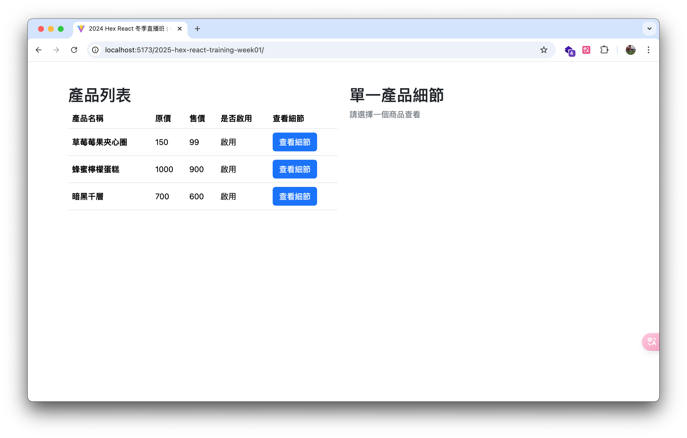
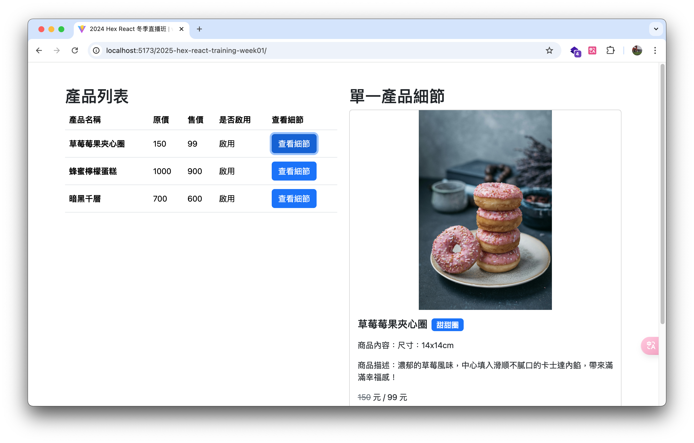
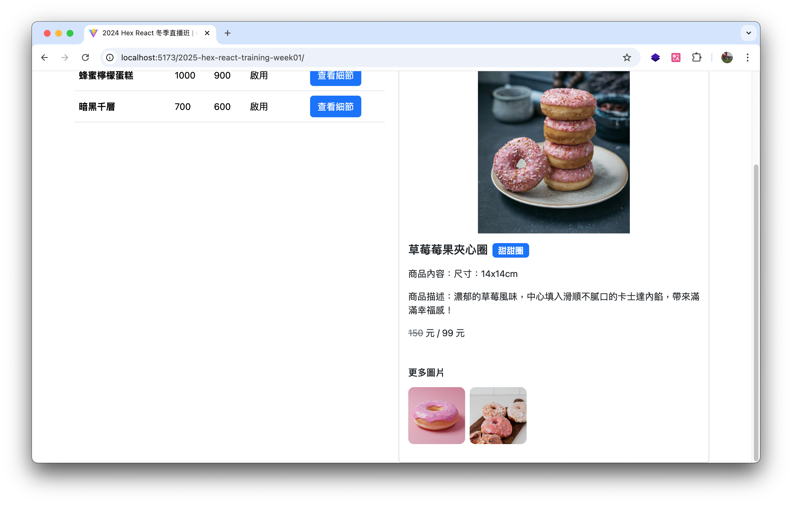

## 2024 Hex React week 01 主線任務 - 從函式拆解認識設計模式

這是課程第一週的專案，目標是透過函式拆解與 React 初始架構，建立一個產品列表與產品詳細說明的簡易商品展示網頁。

🔗 [前往 Demo](https://itsdaiyy.github.io/2024-hex-react-training-week01/)

---

### ✨ 使用者功能

- 使用者可以查看產品列表
- 使用者可以點擊單一產品，查看詳細資訊

---

### 🎯 專案學習重點

- 關注點分離
- React 設計模式
- React 初始化

---

### 🛠 使用技術

- **前端框架 |** React (Vite)
- **樣式設計 |** CSS Modules, Bootstrap
- **專案部署 |** GitHub Pages 

---

### 🚀 安裝與啟動專案

本專案使用 [Vite](https://vitejs.dev/) 作為開發工具，請先確認你已安裝 [Node.js](https://nodejs.org/zh-tw/)（建議版本 18+）。

```bash
# 1. 下載專案
git clone https://github.com/itsdaiyy/2024-hex-react-training-week01.git
cd 2024-hex-react-training-week01

# 2. 安裝套件
npm install

# 3. 啟動開發伺服器
npm run dev
```

---

### 📸 專案截圖




